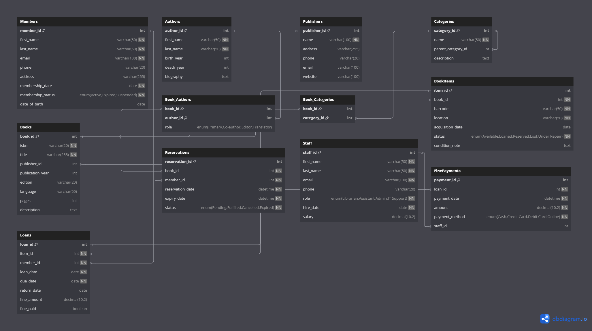

# Library Management System



## Overview
This project implements a comprehensive Library Management System using MySQL. The system is designed to manage all aspects of a library's operations, including book catalog management, member management, loans, reservations, and fine payments.

## Database Structure
The database consists of the following tables:

### Core Entities
- **Members**: Stores information about library members
- **Books**: Contains the main catalog of books
- **Authors**: Information about book authors
- **Publishers**: Details of book publishers
- **Categories**: Hierarchical book categories
- **BookItems**: Physical copies of books available in the library
- **Staff**: Library employees information

### Relationship Tables
- **Book_Authors**: Connects books with their authors (many-to-many)
- **Book_Categories**: Links books to their categories (many-to-many)

### Transaction Tables
- **Loans**: Records of books borrowed by members
- **Reservations**: Requests to borrow books that are currently unavailable
- **FinePayments**: Records of payments for overdue books

## Features
- **Member Management**: Register, update and track member information
- **Book Catalog**: Comprehensive book catalog with details like author, publisher, category
- **Multiple Copies**: Track individual copies of the same book
- **Hierarchical Categories**: Support for main categories and subcategories
- **Loan Management**: Track borrowing history, due dates, and returns
- **Reservation System**: Allow members to reserve books that are currently unavailable
- **Fine Management**: Calculate, track, and collect fines for overdue books
- **Staff Management**: Manage library staff information and roles

## Relationships
- A book can have multiple authors (and vice versa)
- A book can belong to multiple categories
- A category can have subcategories
- A book can have multiple physical copies (book items)
- A member can borrow multiple books
- A member can make multiple reservations
- Loans that incur fines can have payment records

## Constraints
The database implements various constraints to maintain data integrity:
- Primary and foreign key constraints
- Not null constraints for required fields
- Unique constraints for fields like email, ISBN, barcode
- Check constraints for logical validations (e.g., death year > birth year)
- Enumerated types for fields with predefined values

## Sample Data
The database includes sample data for all tables, providing examples of:
- Library members with different membership statuses
- Books from various genres with their authors and publishers
- Multiple copies of books with different statuses
- Active loans and reservations
- Sample fine payments

## Schema Visualization
The database schema visualization was created using [dbdiagram.io](https://dbdiagram.io/), showing all tables and their relationships.

## Getting Started

### Prerequisites
- MySQL Server 5.7 or higher

### Installation
1. Clone this repository
2. Import the SQL file into your MySQL server:
   ```
   mysql -u username -p < library_management.sql
   ```
3. Verify the installation by checking the created tables:
   ```
   mysql -u username -p -e "USE library_management; SHOW TABLES;"
   ```

## Usage Examples

### Find available books
```sql
SELECT b.title, b.isbn, COUNT(bi.item_id) AS available_copies
FROM Books b
JOIN BookItems bi ON b.book_id = bi.book_id
WHERE bi.status = 'Available'
GROUP BY b.book_id;
```

### Check overdue loans
```sql
SELECT m.first_name, m.last_name, b.title, l.due_date, 
       DATEDIFF(CURRENT_DATE, l.due_date) AS days_overdue
FROM Loans l
JOIN Members m ON l.member_id = m.member_id
JOIN BookItems bi ON l.item_id = bi.item_id
JOIN Books b ON bi.book_id = b.book_id
WHERE l.return_date IS NULL AND l.due_date < CURRENT_DATE;
```

## License
This project is licensed under the MIT License - see the LICENSE file for details.

## Contributors
- Sydwell Lebeloane
